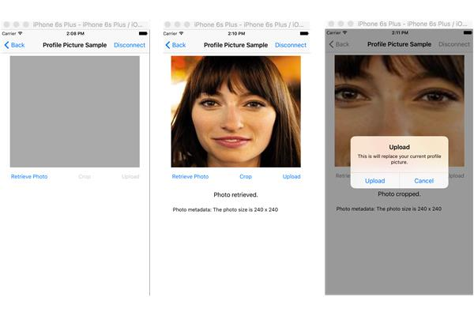

#Microsoft Graph SDK Profile Picture Sample for iOS

This sample is a lightweight iOS project for working with profile pictures in Microsoft Graph, a unified endpoint for accessing data, relationships and insights that come from the Microsoft Cloud. It shows how to connect and authenticate to the service, and then call user photo APIs through the [Microsoft Graph SDK for iOS](https://github.com/microsoftgraph/msgraph-sdk-ios).

It will cover the following:

- Retrieving a profile picture for the signed in user from Office 365
- Retrieving photo meta data such as the image height and width
- Basic cropping of the profile picture
- Uploading a newly cropped image as a profile picture in Office 365

> Note: Try out the [Microsoft Graph App Registration Portal](https://graph.microsoft.io/en-us/app-registration) page which simplifies registration so you can get this sample running faster.

## Prerequisites
* [Xcode](https://developer.apple.com/xcode/downloads/) from Apple
* Installation of [CocoaPods](https://guides.cocoapods.org/using/using-cocoapods.html)  as a dependency manager.
* A Microsoft work account such as Office 365.  You can sign up for [an Office 365 Developer subscription](https://profile.microsoft.com/RegSysProfileCenter/wizardnp.aspx?wizid=14b845d0-938c-45af-b061-f798fbb4d170&lcid=1033) that includes the resources that you need to start building Office 365 apps.

> Note: This sample relies on having an organizational account with a profile picture set in Microsoft Exchange or applied in the user's Outlook profile. If there is one not set, retieval of the photo will fail as no image is found.

* A client id from the registered app at [Application Registration Portal](https://apps.dev.microsoft.com). Once at the site click **Go to app list.** From here you can add an app (mobile application), and record the Client ID for the steps below in **Running this sample in Xcode.**

## Running this sample in Xcode

1. Clone this repository.
2. Use CocoaPods to import the SDK dependencies. This sample app already contains a podfile that will get the pods into the project. Simply navigate to the project root from **Terminal** and run:

        pod install

  	 For more information, see **Using CocoaPods** in [Additional Resources](#AdditionalResources)

3. Open **iOS-ObjectiveC-ProfilePicture-SDK-sample.xcworkspace**
4. Open **Authentication/AuthenticationConstants.m**. You'll see that the **Client ID** from the registration process can be added to the top of the file:

    	// You will set your application's clientId.
		
		NSString * const kClientId    = @"ENTER_YOUR_CLIENT_ID";

5. Run the sample. You'll be asked to connect/authenticate to a work mail account and you'll provide your Office 365 credentials. Once authenticated you'll be taken to the profile controller where you'll have the ability to retrieve both the signed in user's photo and associated meta data. Also, you'll have the ability to crop the photo and upload the newly cropped image to Office 365.

> Note: The cropping functionality here is basic, and just meant to assist with demonstrating uploading a new image to Office 365. It takes the center portion of the rendered image and displays as a newly cropped image. If you crop a picture and wish to return to the original, click **Retrieve Photo.** Any uploaded profile picture must meet the minimum size requirements of 48x48.

##Code of Interest

***Contollers/ConnectViewController*** - Authenticates the user. From here a call is made into the **AuthenticationProvider** to obtain an access token,  **connectToGraphWithClientId: (NSString)clientId scopes(NSArray)completion:**. Also an instance of the authentication provider is passed over to the **ProfilePictureController** to help initialize the Microsoft Graph client object needed for all Microsoft Graph calls.

***Authentication/AuthenticationConstants.m*** - Here is where the app ClientId from the registration process is added to the project. Also, it's where the app permission scopes are defined. To access and work with the signed in user's profile pic the following scope must be supplied:

	https://graph.microsoft.com/User.ReadWrite

***Controllers/ProfilePictureController*** - This controller is responsible for initializing the **MSGraphClient**, and houses all Microsoft Graph photo operations.

-*Gets the signed-in user's photo if they have a photo in Office 365.*

	- (void)getProfilePicture {
   		 [[[self.graphClient me]photoValue] downloadWithCompletion:^(NSURL *location, NSURLResponse *response, NSError *error) {     
   	 	}];
	}

-*Gets the signed-in user's photo data if they have a photo (height and width).*

	- (void)getPhotoMetadata {
    	[[[[self.graphClient me]photo]request]getWithCompletion:^(MSGraphProfilePhoto *response, NSError *error) {
    	}];
	}

-*Uploads signed-in user's photo.*

	- (void)uploadPhoto {
   	 	NSData *croppedImage = UIImagePNGRepresentation(self.profilePictureImage.image);
    	[[[self.graphClient me] photoValue] uploadFromData:croppedImage completion:^(MSGraphProfilePhoto *response, NSError *error) {
  	  }];
	}

## Questions and comments

We'd love to get your feedback about the Microsoft Graph SDK Profile Picture Sample. You can send your questions and suggestions to us in the [Issues](https://github.com/microsoftgraph/iOS-objectiveC-profile-picture-sample/issues) section of this repository.

Questions about Microsoft Graph development in general should be posted to [Stack Overflow](http://stackoverflow.com/questions/tagged/Office365+API). Make sure that your questions or comments are tagged with [Office365] and [MicrosoftGraph].

## Contributing
You will need to sign a [Contributor License Agreement](https://cla.microsoft.com/) before submitting your pull request. To complete the Contributor License Agreement (CLA), you will need to submit a request via the form and then electronically sign the CLA when you receive the email containing the link to the document.

This project has adopted the [Microsoft Open Source Code of Conduct](https://opensource.microsoft.com/codeofconduct/). For more information see the [Code of Conduct FAQ](https://opensource.microsoft.com/codeofconduct/faq/) or contact [opencode@microsoft.com](mailto:opencode@microsoft.com) with any additional questions or comments.

## Additional resources

* [Microsoft Graph overview page](https://graph.microsoft.io)
* [Using CocoaPods](https://guides.cocoapods.org/using/using-cocoapods.html)

## Copyright
Copyright (c) 2016 Microsoft. All rights reserved.

